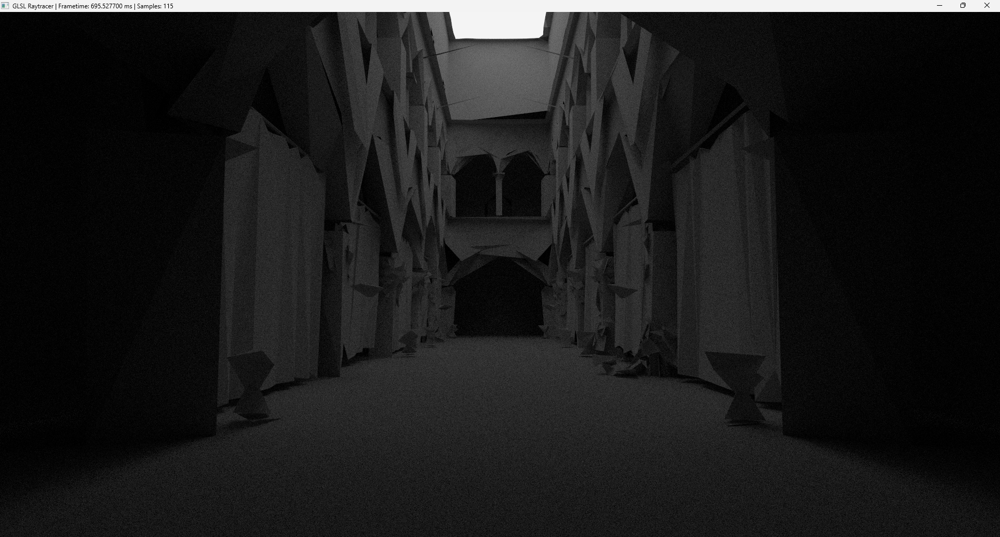

<h1>Mikael Nyman, Software Developer</h1>
<h2>Interested in all things programming and computer graphics, especially ray/path tracing and other global illumination techniques!</h2>
<h2>Currently working on a toy <a href="https://github.com/MiksuNy/Path_tracer">path tracer</a> for fun and learning.</h2>

  </img>
  
Low poly sponza scene with fully diffuse materials rendered in my path tracer

